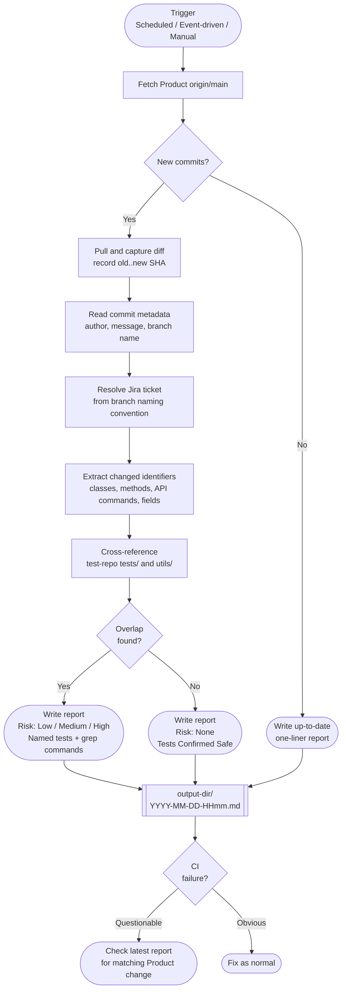

# Shift-Left Monitor

> **What this solves:** CI failures are reactive — by the time Jenkins flags a test, the source change that broke it has already merged. This monitor runs proactively, cross-referencing product source changes against the test suite before failures surface. The result is a timestamped risk report that tells you exactly which tests are at risk, what the blast radius is, and where automation coverage gaps exist — before or the moment a failure appears.

Scheduled, event-driven, or on-demand monitor that cross-references product source changes against the Playwright test suite and produces a structured risk report.

## Trigger Modes

| Mode | When it fires | Use case |
|---|---|---|
| **Scheduled** | Configurable cron expression | Routine coverage — catches overnight and morning merges |
| **Event-driven** | On merge to main / deploy event | Closes the gap between cron windows — commit context is passed directly, no separate lookup needed |
| **Manual** | `python -m monitor run` | On-demand triage when a CI failure is already in progress |

All three modes produce the same report format and write to the same output directory, configurable via `.env`.

## Pipeline



## Risk Scoring

| Level | Criteria |
|---|---|
| **None** | No overlap between changed identifiers and test references |
| **Low** | Overlap found in test utilities or helper functions — indirect risk, unlikely to cause immediate failure |
| **Medium** | Overlap in named test specs — tests directly reference the changed code path |
| **High** | Overlap in a base class, shared utility, or core API command — blast radius extends beyond named tests, multiple specs at risk |

Risk level is determined by the depth and breadth of the overlap. A single changed method referenced in one spec is Low. A changed base class used across dozens of tests is High.

## Report Header

Every report opens with a standard context block populated from commit metadata and branch resolution. This is what makes the report immediately actionable without manual lookup:

```markdown
## Run Context
| Field        | Value                          |
|---|---|
| Commit       | abc1234                        |
| Author       | @developer-name                |
| Message      | "feat: update payment handler" |
| Jira Ticket  | PROJ-123                       |
| Branch       | feature/PROJ-123-payment-fix   |
| Diff Range   | abc1234..def5678               |
| Report Time  | 2026-05-02 08:00               |
| Risk Level   | Medium                         |
```

The Jira ticket is resolved automatically from the branch naming convention visible in the multi-root workspace. No manual input required.

---

## Required Report Sections

Every report with an overlap must include these sections when applicable — do not omit them on medium or low severity reports:

### Blast Radius
Include whenever a change affects a code path broader than the named tests. Examples: base class changes, shared utility refactors, new validation that rejects previously-accepted input, query changes that alter what data is returned. A single bullet is acceptable if the blast radius is narrow — the goal is that nothing is silently omitted.

### Client Report Watch Areas
Include whenever changed code touches functionality with no automation coverage. For each gap, list: the API command or UI flow, the symptom a client would report, and the technical reason it could break. These are the silent failures CI won't catch.

### Tests at Risk — UI coverage
Tests at Risk must cover both API tests **and** UI/browser tests. UI tests often don't reference product source identifiers directly — use domain-level inference:
- Product touches a payment method → check billing-related specs and any tests covering payment flows
- Product touches user permissions → check auth specs and role-based access tests
- Product touches a data import or bulk operation → check import pipeline specs and related API utils

Badge UI test entries with a `UI` type label distinct from `API`.

---

## Reports
Timestamped reports accumulate in the configured output directory. Each run produces one file — check the timestamp closest to when a failure appeared in the pipeline.
