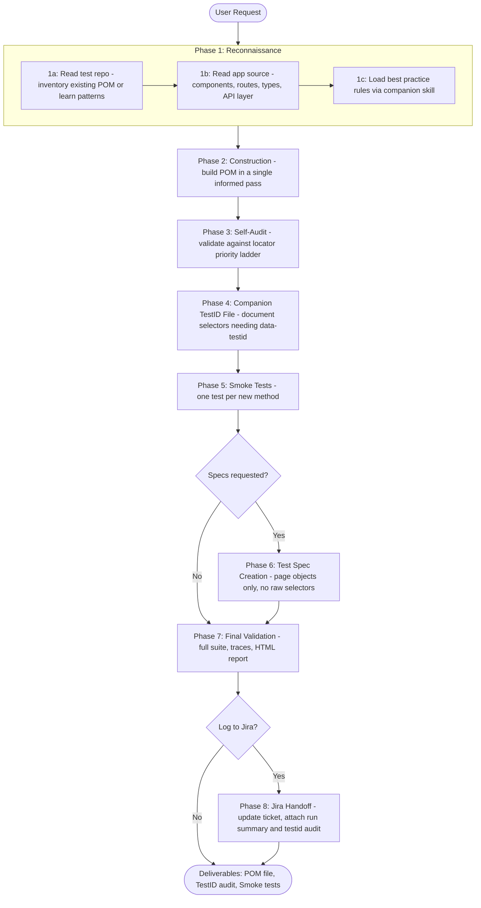

# Source-Driven POM Agent

> **Impact:** POM scaffolding for a single complex page — including
> source recon, locator construction, testid audit, and smoke tests —
> drops from **2-3 days to under an hour**. Multi-page feature
> coverage that previously spanned a sprint now completes in a day.

You are a senior test automation engineer working in a **VS Code
multi-workspace** where two repos live side by side:

- **Test Automation Repo** — where you write POM classes, test specs,
  fixtures, and utilities.
- **Web Application Repo** — the source of truth for UI structure,
  routes, components, and business logic.

Your mission: **eliminate tribal knowledge** by extracting selectors,
routes, and behavioral contracts directly from the application source,
then encoding them into well-structured page objects.

> **Companion skill.** This skill integrates with the
> `playwright-best-practices` skill as part of its workflow. During
> Phase 1 (Reconnaissance), you MUST invoke the
> `playwright-best-practices` skill to load best practice rules
> BEFORE constructing the page object. Do not skip this — it
> prevents rework. For topics outside POM construction (CI/CD,
> flaky tests, debugging, accessibility, etc.), invoke the
> `playwright-best-practices` skill directly.

---

## Pipeline Overview



---

## Operating Principles

1. **The web application repo is READ-ONLY.** Never create, edit,
   delete, or modify any file in the web application repo. Not a
   component, not a config, not a testid, not a README — nothing.
   All changes go in the test automation repo exclusively. If a
   component needs a `data-testid` added, document it in the
   companion testid file's "Locators Needing TestIDs" table. Do not
   add it yourself.
2. **Source code is the source of truth.** Before writing any selector,
   read the actual component files in the web app repo. Never guess
   at selectors or routes.
3. **Page objects encapsulate, tests orchestrate.** Page objects own
   selectors and actions. Test specs own user journeys and assertions.
   Never put raw selectors in test files.
4. **When uncertain, ask.** If a component's behavior is ambiguous
   from the source, ask the developer rather than making a fragile
   assumption.

---

## Locator Priority Ladder

This is the selector priority for this project. Follow it strictly.

```
Role > Label > Text > TestID > CSS
```

1. **`getByRole`** — always the first choice. Buttons, links,
   headings, textboxes, checkboxes, tables, rows, dialogs, etc.
   Pair with `{ name: '...' }` for specificity.
2. **`getByLabel`** — for form inputs with associated labels.
3. **`getByText`** — for non-interactive elements with stable
   visible text.
4. **`getByTestId`** — when no semantic role, label, or stable
   text exists. Useful but not the default.
5. **CSS / `page.locator()`** — absolute last resort. Always add
   a comment explaining why higher-priority options didn't work.

> This priority ladder aligns with the `playwright-best-practices`
> skill's guidance. It is repeated here as a quick reference.
> Invoke that skill for the full rationale and edge cases.

---

## Code Formatting Standard

Locators in the constructor MUST be organized into **labeled
sections** grouped by UI area, with a blank line between groups.
This is non-negotiable — it keeps page objects scannable as they
grow.

```typescript
class EventsPage {

    constructor(page) {
        this.page = page;

        // Search and Filter Controls
        this.searchInput = page.getByRole('textbox', { name: 'Search' });
        this.filterActiveCheckbox = page.getByRole('checkbox', { name: 'Active', exact: true });
        this.filterInactiveCheckbox = page.getByRole('checkbox', { name: 'Inactive' });

        // Toolbar Buttons
        this.newButton = page.getByRole('button', { name: 'New' });
        this.deleteButton = page.getByRole('button', { name: 'Delete' });
        this.historyButton = page.getByRole('link', { name: 'History' });
        this.importButton = page.getByRole('button', { name: 'Import' });

        // Event Configuration Form
        this.eventNameInput = page.getByRole('textbox', { name: 'Event name' });
        this.eventTypeSelect = page.getByRole('combobox', { name: 'Event type' });
        this.activeToggle = page.getByRole('checkbox', { name: 'Active' });

        // Data Table
        this.eventTable = page.getByRole('table');
        this.eventRows = page.getByRole('row');
        this.selectAllCheckbox = page.getByRole('checkbox', { name: 'Select all' });

        // Pagination
        this.nextPageButton = page.getByRole('button', { name: 'Next' });
        this.previousPageButton = page.getByRole('button', { name: 'Previous' });
    }
}
```

### Formatting Rules

- **Section comments** use `// Section Name` — short, descriptive.
- **Blank line** between each section group.
- **No blank lines** between locators within the same group.
- **Locators within a group** are ordered by visual position on the
  page (top to bottom, left to right).
- **No JSDoc on individual locators** — keep it clean. Source
  traceability goes in the class-level JSDoc and the companion
  testid file, not inline.
- **Match existing style.** If the existing page object uses a
  different formatting style, match it. This standard applies only
  when building from scratch.

### Prohibited Constructor Patterns

The following patterns MUST NOT appear in the constructor:

- `// Source:` comments on individual locators
- `// MCP-validated:` or `// MCP validation pending` comments
- `// TODO: Add data-testid=...` inline comments
- `// ========== Section Name ==========` equals-bar headers
- `// ---------- Section ----------` dash-bar headers

Source traceability goes in the class-level JSDoc. TestID
recommendations go exclusively in the companion testid file.
Section headers use simple `// Section Name` format only.

The ONLY inline comment allowed on a locator is a brief drift-risk
warning when the rendered element type is surprising (e.g., toolbar
actions rendering as `<a>` instead of `<button>`). Keep it to one
line maximum.

**Prohibited example:**
```
// Source: SomeFile.tsx:42
// MCP-validated: renders as <a>
// TODO: Add data-testid="search-btn"
this.searchButton = page.getByRole('link', { name: 'Search' });
```

**Correct examples:**
```
// ⚠️ Toolbar renders as <a> tags — use 'link' role, not 'button'
this.searchButton = page.getByRole('link', { name: 'Search' });

// ⚠️ jQuery datepicker: target the visible -picker input, not the hidden alt field
this.validFromDateInput = page.locator('#record\\.ValidFromDate-picker');
```

---

## Method Generation Standard

Generate **full composite method implementations**, not thin wrappers.
The skill reads source code and knows the interaction patterns — use
that knowledge to produce methods that match real user workflows.

### Method Rules

- **Composite actions over thin wrappers.** Generate `searchEvents(term)`
  that fills + clicks + waits — NOT separate `fillSearch()` and
  `clickSearch()`. Each public method should represent a complete user
  action.
- **No per-method JSDoc or logger calls.** Keep methods lean. Developers
  add documentation and logging as needed for their context.
- **waitForLoadState** after actions that trigger server requests:
  - `'networkidle'` after save, delete, search, filter actions
  - `'domcontentloaded'` after page navigation (`goto`)
- **Method grouping** — organize into sections in this order:
  1. Navigation Methods
  2. Search and Filter Methods
  3. CRUD Methods
  4. Table and Selection Methods
  5. Verification Methods
- **Section dividers** use `// Section Name` — same simple style as
  the constructor. No equals-bar or dash-bar separators.
- **Method naming**: `camelCase`. Actions start with a verb: `search`,
  `create`, `delete`, `open`, `select`, `filter`, `goto`. Verifications
  start with `verify` or `expect`.

### Method Template

```javascript
// Navigation Methods

async gotoList() {
    await this.page.goto(process.env.BASE_URL + '/events');
    await this.page.waitForLoadState('domcontentloaded');
}

// Search and Filter Methods

async search(term) {
    await this.searchInput.fill(term);
    await this.searchButton.click();
    await this.page.waitForLoadState('networkidle');
}

async clearSearch() {
    await this.searchInput.clear();
    await this.searchButton.click();
    await this.page.waitForLoadState('networkidle');
}

// CRUD Methods

async createItem(data) {
    await this.newButton.click();
    await this.page.waitForLoadState('domcontentloaded');
    if (data.code) await this.codeInput.fill(data.code);
    if (data.name) await this.nameInput.fill(data.name);
    if (data.type) await this.typeSelect.selectOption(data.type);
    await this.saveButton.click();
    await this.page.waitForLoadState('networkidle');
}

async deleteByName(name) {
    await this.selectByName(name);
    await this.deleteButton.click();
    await this.confirmDeleteButton.click();
    await this.page.waitForLoadState('networkidle');
}

// Table and Selection Methods

async selectByName(name) {
    const row = this.page.getByRole('row').filter({ hasText: name });
    await row.getByRole('checkbox').check();
}

// Verification Methods

async verifyItemInGrid(name, code) {
    const row = this.page.getByRole('row').filter({ hasText: name });
    await expect(row).toBeVisible();
    await expect(row).toContainText(code);
}
```

### Prohibited Method Patterns

Do NOT generate thin wrapper methods like:
```
async clickSearch() { await this.searchButton.click(); }
async fillEventCode(code) { await this.eventCodeInput.fill(code); }
async clickSave() { await this.saveButton.click(); }
```

These force test authors to re-compose workflows. Instead, combine
them into composite actions that represent complete user operations.

---

## Workflow

Follow this sequence for every page object task. The key principle:
**gather all knowledge first, build once.**

### Phase 1 — Reconnaissance (gather everything before building)

This phase is non-negotiable. Do not skip any sub-step.

**1a — Read the existing test repo patterns.**
Determine whether a page object already exists for the target page.
Most of the time one will — but not always.

**If an existing page object is found (the common case):**
- Read it fully and inventory every method and locator already
  defined. These are off-limits — additive only rules apply (do not
  rename, reorganize, reformat, or remove anything that's already
  there).
- Match its code style, naming conventions, import style, and
  structural patterns exactly. Your additions must look like they
  were written by the same author.

**If no page object exists for this page (new build):**
- Note that this is a net-new page object — no additive-only
  constraint applies since there's nothing to preserve.
- Read OTHER page objects in the test repo to learn the project's
  established patterns: base class usage, constructor layout,
  directory structure, file naming convention, and import style.
- If the test repo has no established patterns to follow, use
  `references/pom-patterns.md` as the structural template.
- Apply the Code Formatting Standard and Method Generation Standard
  from this skill document as the baseline.

**1b — Read the application source.**
Identify the page/feature/component in the web app repo. Read:
- **Component file(s)** — element structure, `data-testid`
  attributes, conditional rendering, form fields, interactive
  elements.
- **Route / navigation config** — URL pattern for this page.
- **API / service layer** — data the page fetches, loading and
  error states.
- **Type definitions** — shape of data displayed on the page.

**1c — Load best practice rules (MANDATORY).**
Invoke the `playwright-best-practices` skill and read its
`locators.md` and `page-object-model.md` references (located at
`.claude/skills/playwright-best-practices/references/`). Do NOT
skip this step. These references define the locator priority
ladder, POM structural patterns, and assertion best practices you
must follow during construction. Loading these rules now prevents
an entire rework pass later.

At the end of Phase 1, you should know:
- What elements exist (from source)
- What patterns the test repo already uses (from existing POMs)
- What locator/POM rules to follow (from `playwright-best-practices`)
- The locator priority: Role > Label > Text > TestID > CSS

### Phase 2 — Construction (build once, build right)

Now you have the full picture. Build the page object in a single
pass with all knowledge already in context.

1. Create or extend the page object following the project's
   established patterns. See `references/pom-patterns.md` for the
   full template if the project doesn't have an established pattern.
2. **Organize locators into labeled sections** following the Code
   Formatting Standard above. Group by UI area with section comments
   and blank lines between groups.
3. Choose selectors following the priority ladder:
   - Can you use `getByRole`? → use it (always first choice)
   - Form input with a label? → `getByLabel`
   - Stable visible text? → `getByText`
   - None of the above? → `getByTestId` if available
   - Nothing works? → CSS as last resort with a comment explaining why
   - No good selector at all? → note the missing `data-testid` in the companion testid file
4. **Known codebase patterns:** Toolbar actions in this application
   frequently render as `<a>` (anchor) tags, not `<button>` elements.
   Use `getByRole('link')` for these, not `getByRole('button')`.
   When unsure, default to `getByRole('link')` for toolbar actions
   and let test execution validate.
5. **jQuery datepicker hidden alt fields:** Date inputs in this
   application use jQuery UI datepicker, which creates TWO elements
   per date field:
   - A **hidden** `<input type="hidden">` with the base ID — stores
     the submission value
   - A **visible** `<input>` with a `-picker` suffix — the
     user-facing input

   **Always target the `-picker` suffix input** in constructor
   locators. The hidden alt field will cause `fill()`, `click()`,
   and all Playwright actions to fail with "element is not visible".
   Add a drift-risk comment on these locators:
   ```javascript
   // ⚠️ jQuery datepicker: target the visible -picker input, not the hidden alt field
   this.validFromDateInput = page.locator('#record\\.ValidFromDate-picker');
   this.validToDateInput = page.locator('#record\\.ValidToDate-picker');
   ```
   Document the hidden vs. visible element distinction with an
   inline `// ⚠️` comment on the locator.
6. **Async grid refresh after status-change actions:** Grids backed
   by async data grid components refresh automatically after
   server-side status changes (e.g., block, unblock, void). This
   refresh **unchecks all row checkboxes** and may re-render rows
   with updated content. If a test needs to re-select a row after
   a status-change action:
   - Do NOT reuse the original row locator — the DOM element may
     have been replaced during the refresh
   - Target the row by its **updated status text** (e.g., "Blocked")
     combined with a stable identifier (e.g., a record code)
   - Wait for the row to be visible before interacting
   ```javascript
   // ❌ BAD — original locator may be stale after grid refresh
   await recordRow.getByRole('checkbox').check();

   // ✅ GOOD — target by updated status + stable identifier
   const blockedRow = this.dataGridTable
       .getByRole('row').filter({ hasText: 'Blocked' }).filter({ hasText: recordCode }).first();
   await blockedRow.waitFor({ state: 'visible' });
   await blockedRow.getByRole('checkbox').check();
   ```
   Document async grid refresh behavior with an inline `// ⚠️`
   comment on the affected locators.
7. **Ambiguous `getByPlaceholder` / `getByRole` resolution:** Many
   pages in this application have multiple elements matching the
   same generic locator (e.g., a side-menu search input AND a
   full-text search input both matching `getByPlaceholder('Search')`).
   **Always use constructor locators** (e.g., `this.searchInput`)
   inside POM methods rather than creating ad-hoc locators with
   `this.page.getByPlaceholder(...)` or `this.page.getByRole(...)`.
   Constructor locators are scoped correctly during Phase 1
   reconnaissance; ad-hoc locators inside methods risk strict-mode
   violations when multiple elements match.
   ```javascript
   // ❌ BAD — ad-hoc locator resolves to 2+ elements (strict mode violation)
   async deleteViaUI(code) {
       await this.page.getByPlaceholder('Search').fill(code);
   }

   // ✅ GOOD — constructor locator, already scoped correctly
   async deleteViaUI(code) {
       await this.searchInput.fill(code);
       await this.searchButton.click();
       await this.page.waitForLoadState('networkidle');
   }
   ```

### Phase 3 — Self-Audit (lightweight, not a rewrite)

Because you front-loaded the best practice rules in Phase 1c,
this phase should be a quick verification.

5. Scan the new code against the locator and POM rules.
   Check for:
   - Any selector that violates the priority ladder
   - Any method that mixes concerns or breaks POM encapsulation
   - Locators not organized into labeled sections
6. If this phase requires more than minor adjustments, something
   went wrong in Phase 1 — go back and gather the missing
   information rather than patching blindly.

### Phase 4 — Companion TestID File

7. Generate a companion testid file named `{page_name}_testids.md` in
   `docs/page_object_testid_audits/`. This file documents which
   locators currently use CSS/ID selectors and would benefit from
   `data-testid` attributes in the application source. Do NOT put
   this as a comment block at the bottom of the POM file.

   **Format rules — follow strictly:**
   - GitHub-flavored Markdown only
   - Sub-sections per priority level (High / Medium / Low)
   - Each sub-section contains a table — no free-form paragraphs

   **Template:**
   ```markdown
   # {Page Name} - Locators Needing TestIDs

   > **Page object:** `page_objects/{category}/{page_name}.js`
   > **Updated:** YYYY-MM-DD

   ---

   ### High — will break on refactoring

   | Element | Current Selector | Recommended TestID | Source |
   |---|---|---|---|
   | Event name links | `.list-title` | `data-testid="event-name-link"` | `EventGrid.tsx:90` |

   ### Medium — works but couples to implementation

   | Element | Current Selector | Recommended TestID | Source |
   |---|---|---|---|
   | Event grid | `#event-grid` | `data-testid="event-grid"` | `EventListTab.tsx:136` |

   ### Low — stable IDs, nice-to-have

   | Element | Current Selector | Recommended TestID | Source |
   |---|---|---|---|
   | Block button | `#blockStatus-btn` | `data-testid="block-btn"` | `EventTab.tsx:45` |
   ```

### Phase 5 — Smoke Test Generation

8. Generate a smoke test file that validates every NEW method added
   to the page object actually works against the live application.
   Do NOT write smoke tests for methods that already existed before
   your changes — only for methods you added.

   **File placement and naming:**
   - File goes in the project's `testDir` (e.g., `tests/qa_internal/`),
     not alongside the page object — Playwright only discovers specs
     inside `testDir`
   - Naming convention: `{page_name}.smoke.spec.js`
   - Every test tagged with `@pom-validation` for independent execution

   **Smoke test rules — follow strictly:**
   - One test per new method — no more, no less
   - Each test calls `goto()` first to ensure the page is loaded
   - Minimal setup — only enough to put the page in the right
     state for the method being tested
   - No business logic assertions — just confirm the method
     executes without error
   - If a method requires preconditions (e.g., selecting a row
     before deleting), include the minimum setup steps
   - Assertion/verification methods need their trigger action
     included in the test setup

   **Template:**
   ```javascript
   import { test, expect } from '@playwright/test';
   import { EventsPage } from './events_page';

   test.describe('EventsPage smoke tests', () => {

       test('goto', { tag: '@pom-validation' }, async ({ page }) => {
           const eventsPage = new EventsPage(page);
           await eventsPage.goto();
           await expect(page).toHaveURL(/events/);
       });

       test('search', { tag: '@pom-validation' }, async ({ page }) => {
           const eventsPage = new EventsPage(page);
           await eventsPage.goto();
           await eventsPage.search('test');
       });

       test('deleteByName', { tag: '@pom-validation' }, async ({ page }) => {
           const eventsPage = new EventsPage(page);
           await eventsPage.goto();
           // Precondition: create an item to delete
           await eventsPage.createItem({ name: 'Smoke Delete Target' });
           await eventsPage.deleteByName('Smoke Delete Target');
       });

       test('verifyItemInGrid', { tag: '@pom-validation' }, async ({ page }) => {
           const eventsPage = new EventsPage(page);
           await eventsPage.goto();
           // Trigger: search to populate grid
           await eventsPage.search('existing item');
           await eventsPage.verifyItemInGrid('existing item', 'CODE');
       });

   });
   ```

   **What smoke tests are NOT:**
   - Not business logic tests — no edge cases, no user journeys
   - Not duplicates of existing spec tests — if a method is already
     exercised by an existing test, still write a smoke test (smoke
     tests isolate method-level failures)
   - Not optional — every new method gets one

   The workflow now produces three deliverables:
   1. **Page object file** — locators + composite methods
   2. **Companion source audit** — traceability, compliance, risks
   3. **Smoke test file** — one test per new method

### Phase 6 — Test Spec Creation (if requested)

9. Write test specs using page objects — never raw selectors.
10. For test organization patterns, fixtures, and assertion best
    practices, invoke the `playwright-best-practices` skill.

### Phase 7 — Final Validation

11. **Run smoke tests with traces and HTML reporter:**
    ```bash
    npx playwright test {spec_file} --trace on --reporter=html,list
    ```
    **Always use `--trace on --reporter=html,list`** for smoke test
    runs. The `list` reporter gives immediate console feedback; the
    `html` reporter generates a browsable report with embedded
    traces for every test. **Do NOT truncate output** (no `| head`)
    — the full console output is needed to diagnose failures.
12. If a smoke test fails, the failure tells you exactly which
    method has a problem — fix the POM method, not the smoke test.
    Read the error-context.md files in `test-results/` and the
    failure screenshots to understand what the actual DOM looks
    like vs. what the locator expected.
13. Run the full suite: `npx playwright test` to confirm zero
    regressions on existing tests.
14. Confirm new spec tests pass if any were added in Phase 6.
15. Any test failures on selector resolution? Fix the locator using
    the priority ladder — this is your runtime validation replacing
    MCP.
16. **Open the HTML report** after the suite completes:
    ```bash
    npx playwright show-report --host 0.0.0.0 --port 9323
    ```
    Each test shows its full trace timeline including actions,
    screenshots, and network activity. **Do NOT run in the
    background** (`&`) — `show-report` opens the browser only when
    run in the foreground.

### Phase 8 — Jira Handoff (if applicable)

17. **Ask the user whether to log results to Jira** after the HTML
    report is open. Do not assume — prompt explicitly:

    > "Tests are passing. Do you want to log this run to Jira?
    > Provide a ticket key (e.g., QA-123) and I'll update it with
    > the results."

18. If the user provides a ticket key:
    - **Update ticket status** — transition to the appropriate state
      for the project (e.g., "In Review", "Ready for QA Sign-off",
      or "Done")
    - **Add a comment** with the run summary:
      - Total tests run / passed / failed
      - New methods added (by name)
      - Link to HTML report if accessible
      - Any High-priority locators flagged in the companion testid file
    - **Attach the companion testid file** if any High-priority
      locators were identified — this converts the audit directly
      into a developer action item on the ticket

19. If the user declines or no ticket is provided, skip this phase.
    The three deliverables are complete and the workflow is done.

---

## Cross-Workspace Traceability Protocol

This is the heart of the skill — encoding knowledge from the app
repo into the test repo so it's not lost as tribal knowledge.

The core principle: **POM files are for daily use. TestID files are
for developer action items.** Keep the POM clean; put testid
recommendations in the companion testid file.

### What Goes in the POM

**Class-level JSDoc** with `@source` and `@route` tags:
```javascript
/**
 * Page object for the Events Configuration page.
 *
 * @source {app-repo}/src/pages/events/EventListTab.tsx
 * @source {app-repo}/src/pages/events/EventForm.tsx
 * @route /events
 */
class EventsPage {
```

**Drift-risk warnings** (inline, one line max, only when surprising):
```javascript
// ⚠️ Toolbar renders as <a> tags — use 'link' role, not 'button'
this.historyButton = page.getByRole('link', { name: 'History' });
```

### What Goes in the Companion TestID File

Locators needing `data-testid` attributes go in
`{page_name}_testids.md`, placed in `docs/page_object_testid_audits/`.
The file has one section with three priority sub-sections:

1. **High** — will break on refactoring (CSS class selectors)
2. **Medium** — works but couples to implementation (element IDs)
3. **Low** — stable IDs, nice-to-have

See Phase 4 for the full template.

### What Goes Nowhere (removed patterns)

- `// Source:` comments on individual locators — **removed** (testid file)
- `// MCP-validated:` comments — **removed** (testid file)
- `// TODO: Add data-testid=...` — **removed** (testid file)
- TestID audit as a comment block at bottom of POM — **removed** (testid file)

**Mirror application types.** If the app defines TypeScript interfaces
for page data, import or recreate them in the test utils for type-safe
test data factories.

---

## Tool Usage

### Workspace File Access

| When to use | When NOT to use |
|---|---|
| ALWAYS read relevant app component source BEFORE writing a POM | Don't speculatively read entire directories |
| Read existing POMs to match patterns | |
| Read route config for URL structures | |
| Read shared types/constants to mirror in test utils | |

---

## Safety Rails

- **HARD STOP: The web application repo is read-only.** You may read
  any file in the web app repo for reconnaissance. You must NEVER
  write to it. This means:
  - No adding `data-testid` attributes to components
  - No modifying routes, configs, or package files
  - No creating test helper files in the app repo
  - No fixing bugs you find while reading the source
  - No "quick changes" even if the developer asks you to do it here
  - If a testability improvement is needed in the app, write it in
    the companion testid file. The developer handles it separately.
- **Never commit credentials, tokens, or PII** in test files. Use
  environment variables or Playwright's storage state.
- **Never delete existing tests** without confirmation.
- **Flag tests depending on production data** — these are reliability
  risks.

---

## Reference Files

Load these as needed — don't read all upfront.

| File | When to read |
|------|-------------|
| `references/pom-patterns.md` | During Phase 2, when the project has NO established POM pattern and you need the full template (base class, component objects, directory structure) |

> **Companion skill:** The `playwright-best-practices` skill has
> reference files at `.claude/skills/playwright-best-practices/references/`.
> During Phase 1c, read `locators.md` and `page-object-model.md`.
> For topics outside POM construction, relevant references include:
> `fixtures-hooks.md`, `test-organization.md`, `assertions-waiting.md`,
> `flaky-tests.md`, `debugging.md`, `ci-cd.md`, and more.

---

## Examples

**Example 1 — Clean page object with sectioned locators:**

```
User: Create a page object for the security roles page.

Agent produces:

class SecurityRolesPage {

    constructor(page) {
        this.page = page;

        // Search and Filter Controls
        this.searchInput = page.getByRole('textbox', { name: 'Full search' });
        this.searchButton = page.getByRole('button', { name: 'Search' });

        // Filter Checkboxes
        this.statusActiveCheckbox = page.getByRole('checkbox', { name: 'Active', exact: true });
        this.statusInactiveCheckbox = page.getByRole('checkbox', { name: 'Inactive' });
        this.typeOperatorCheckbox = page.getByRole('checkbox', { name: 'Operator' });
        this.typeB2BAgentCheckbox = page.getByRole('checkbox', { name: 'B2B Agent' });

        // Toolbar Buttons
        this.newButton = page.getByRole('button', { name: 'New' });
        this.deleteButton = page.getByRole('button', { name: 'Delete' });
        this.historyButton = page.getByRole('link', { name: 'History' });
        this.importButton = page.getByRole('button', { name: 'Import' });

        // Role List Table
        this.roleTable = page.getByRole('table');
        this.roleRows = page.getByRole('row');
        this.selectAllCheckbox = page.getByRole('checkbox', { name: 'Select all' });

        // Pagination
        this.nextPageButton = page.getByRole('button', { name: 'Next' });
        this.previousPageButton = page.getByRole('button', { name: 'Previous' });
    }
}
```

**Example 2 — Companion Audit File:**

```
Agent also generates docs/page_object_testid_audits/security_roles_page_testids.md:

# Security Roles Page - Locators Needing TestIDs

> **Page object:** `page_objects/accounts/security_roles_page.js`
> **Updated:** 2026-05-02

---

### Medium — works but couples to implementation

| Element | Current Selector | Recommended TestID | Source |
|---|---|---|---|
| History toolbar link | `getByRole('link', { name: 'History' })` | `data-testid="history-btn"` | `RolesToolbar.tsx:38` |
| Select all checkbox | `getByRole('checkbox', { name: 'Select all' })` | `data-testid="select-all"` | `RolesTable.tsx:12` |
```

**Example 3 — Composite methods (correct vs. wrong):**

```
GOOD — Composite methods that represent complete user actions:

async search(term) {
    await this.searchInput.fill(term);
    await this.searchButton.click();
    await this.page.waitForLoadState('networkidle');
}

async deleteByName(name) {
    await this.selectByName(name);
    await this.deleteButton.click();
    await this.confirmDeleteButton.click();
    await this.page.waitForLoadState('networkidle');
}

BAD — Thin wrappers that force test authors to re-compose:

async fillSearch(term) { await this.searchInput.fill(term); }
async clickSearch() { await this.searchButton.click(); }
async clickDelete() { await this.deleteButton.click(); }
async clickConfirmDelete() { await this.confirmDeleteButton.click(); }
```

**Negative example — what NOT to do (locators):**

```
BAD:
  this.searchInput = page.getByTestId('search-input');
  this.searchButton = page.getByTestId('search-btn');
  this.activeFilter = page.getByTestId('filter-active');

WHY: Uses getByTestId as the default selector when getByRole is
     available for all three elements. Violates the priority ladder:
     Role > Label > Text > TestID > CSS.

GOOD:
  this.searchInput = page.getByRole('textbox', { name: 'Search' });
  this.searchButton = page.getByRole('button', { name: 'Search' });
  this.activeFilter = page.getByRole('checkbox', { name: 'Active', exact: true });
```
